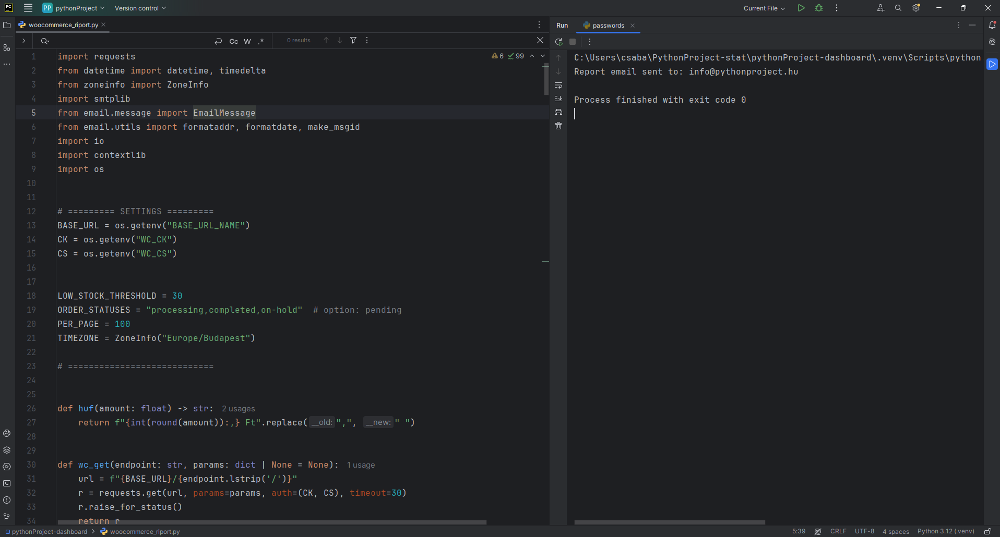
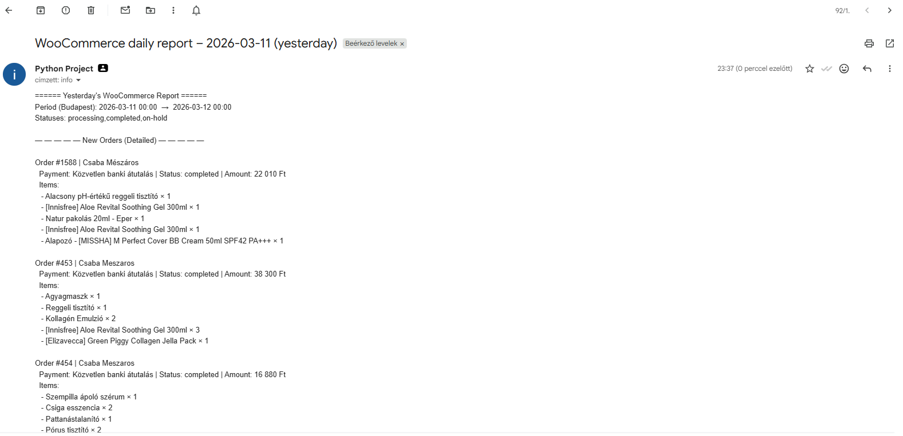
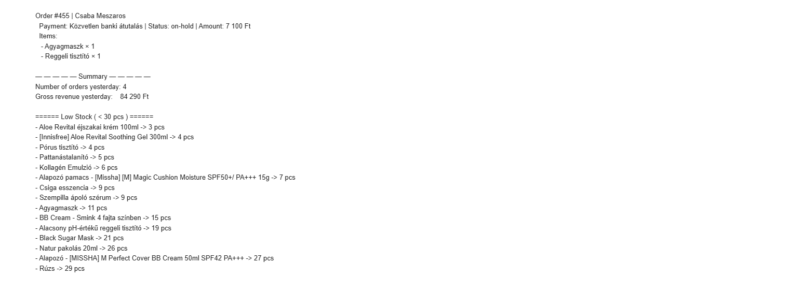

# WooCommerce Daily Report Automation

Python automation script that retrieves WooCommerce order data, calculates daily revenue, checks low-stock products and sends an automated email report.

## 🚀 Features

• Connects to WooCommerce REST API  
• Retrieves yesterday's orders with pagination  
• Calculates total daily revenue  
• Detects low-stock products  
• Sends automated email report via SMTP  

## 🧰 Tech Stack

Python  
WooCommerce REST API  
SMTP email automation  
Environment variables (.env)

## 📦 Example Use Case

Online store owners often need a daily report about:

- how many orders were placed yesterday
- total daily revenue
- which products are running out of stock

This script automates the entire process and sends a daily report via email.

## ⚙️ Installation

```bash
git clone https://github.com/csabametzg/woocommerce-daily-report-automation.git
cd woocommerce-daily-report-automation
pip install -r requirements.txt


## ▶ Run

python main.py


## Example Report Screenshot 1




## Example Report Screenshot 2




## Example Report Screenshot 3




## Notes

- Credentials are loaded from environment variables.
- Do not commit real API keys or SMTP passwords to GitHub.
- The script uses the Europe/Budapest timezone.
- The script sends plain-text email reports.


## Future Improvements

- Export report to CSV
- Add HTML email formatting
- Add logging
- Add retry handling for failed requests
- Add separate product sales summary


